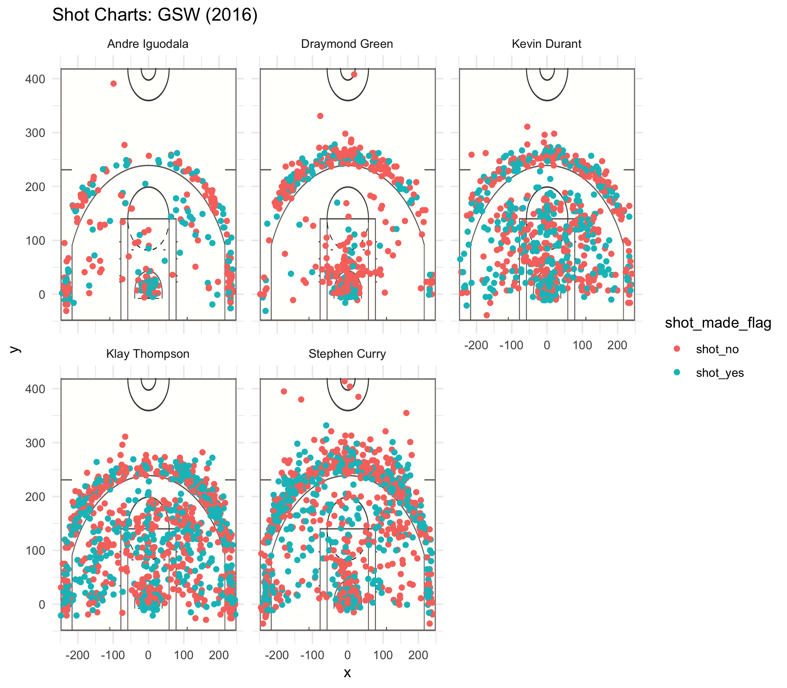

workout01-daniel-seo
================
Daniel Seo
3/14/2019

**Introduction**
----------------

This report will focus analyzing the five players that represent the Golden State Warriors of their performances in 2016 : Andew Iguodala, Draymond Green, Kevin Durant, Klay Thompson and Stephen Curry.

**Motivation**
--------------

The Golden State Warriors has many players with phenomenal records. It has always interested me to see how much further the Warriors can continue their dominant performace. As an individual who loves to play around with numbers, being able to manipulate data sets and analyzing each individual player's ability of his role fascinates me.

**Background**
--------------

Best Team of All Time?
======================


The Golden State Warriors is arguably the most consistent and strongest team in the NBA in the last couple of years. Under coach Steve Kerr, the Warriors have won the championships in the 2014-2015, 2016-2017, and 2017-2018 seasons. Setting a new record of a jaw opening performance of 73-9 in the 2015-2016 season, this project is going to analyze and intepret the performances of the 5 key players that allowed this to happen.

**Data**
--------

The data that we will be using for this report is obtained from Professor Gaston Sanchez's Stat 133 Github. The data given contains the year of the season(2016), the date of the game, the opponent, minutes/seconds remaining, shot type, and shot distance in terms of x and y coordinates (in inches). This allows us to do various data manipulation techniques to better visualize each player's performance.

**Analysis**
------------



``` r
gsw_players <- read.csv(file = '../data/shots-data.csv', stringsAsFactors = FALSE)
```

``` r
two_point_effective <- gsw_players %>% filter(shot_type == "2PT Field Goal") %>% 
  group_by(name) %>%
  summarise(total = n(),
            made = sum(shot_made_flag == "shot_yes"),
            perc_made = made/total) %>%
  arrange(desc(perc_made))
  
two_point_effective 
```

    ## # A tibble: 5 x 4
    ##   name           total  made perc_made
    ##   <chr>          <int> <int>     <dbl>
    ## 1 Andre Iguodala   210   134     0.638
    ## 2 Kevin Durant     643   390     0.607
    ## 3 Stephen Curry    563   304     0.540
    ## 4 Klay Thompson    640   329     0.514
    ## 5 Draymond Green   346   171     0.494

### **From the 2 Point effective shooting percentage that we created above, we see that:**

-   Andre Iguodala has the highest 2-point effective shooting percentage of 63.8%
-   Kevin Durant has the most shots of 643, just 3 more than Klay Thompson.
-   Draymond Green has the lowest 2-point effective shooting percentage of 49.4%.
-   The average 2-point effective shooting percentage among these 5 players is around 55.85%.

``` r
three_point_effective <- gsw_players %>% filter(shot_type == "3PT Field Goal") %>%
  group_by(name) %>%
  summarise(total = n(),
            made = sum(shot_made_flag == "shot_yes"),
            perc_made = made/total) %>%
  arrange(desc(perc_made))

three_point_effective  
```

    ## # A tibble: 5 x 4
    ##   name           total  made perc_made
    ##   <chr>          <int> <int>     <dbl>
    ## 1 Klay Thompson    580   246     0.424
    ## 2 Stephen Curry    687   280     0.408
    ## 3 Kevin Durant     272   105     0.386
    ## 4 Andre Iguodala   161    58     0.360
    ## 5 Draymond Green   232    74     0.319

### **From the 3 Point effective shooting percentage that we created above, we see that:**

-   Klay thompson has the highest 3-point effective shooting percentage of 42.4%; Curry has 40.76%.
-   Draymond Green has the lowest 3-point effective shooting percentage of 31.9%.
-   Stephen Curry has shot the most 3 pointers with a total of 687.
-   Stephen Curry has shot more 3 pointers than Kevin Durant, Andre Iguodala, and Draymond Green combined.
-   The average 3-point effective shooting percentage among the 5 players is around 37.9%.
-   We can see that there's a positive correlation between total shots thrown and made.

``` r
total_point_effective <- gsw_players %>%
filter(shot_type %in% c("2PT Field Goal", "3PT Field Goal")) %>%
  group_by(name) %>%
  summarise(total = sum(shot_type %in% c("2PT Field Goal", "3PT Field Goal")),
            made = sum(shot_made_flag == "shot_yes"),
            perc_made = made/total) %>%
  arrange(desc(perc_made))
total_point_effective
```

    ## # A tibble: 5 x 4
    ##   name           total  made perc_made
    ##   <chr>          <int> <int>     <dbl>
    ## 1 Kevin Durant     915   495     0.541
    ## 2 Andre Iguodala   371   192     0.518
    ## 3 Klay Thompson   1220   575     0.471
    ## 4 Stephen Curry   1250   584     0.467
    ## 5 Draymond Green   578   245     0.424

### **From the total effective shooting percentage table above, we find that:**

-   Kevin Durant has the highest total points effective shooting percentage of 54.1%.
-   Draymond Green has the lowest total points effective shotting percentage of 42.4%.
-   Stephen Curry has the highest total shots of 1250 and Klay Thompson has the second highest of 1220.
-   We can see that there is a positive correlation between totals shots thrown and made.
-   The average total effective shooting percentage among the 5 players is around 48.4%.

### **Conclusion**

-   Andre Iguodala has the highest 2 points effective shooting percentage
-   Klay Thompson has the highest 3 points effective shooting percentage
-   Kevin Durant has the highest total points effective shooting percentage
-   The average 2-point effective shooting percentage among these 5 players is around 55.85%.
-   The average 3-point effective shooting percentage among the 5 players is around 37.9%.
-   The average total effective shooting percentage among the 5 players is around 48.4%
